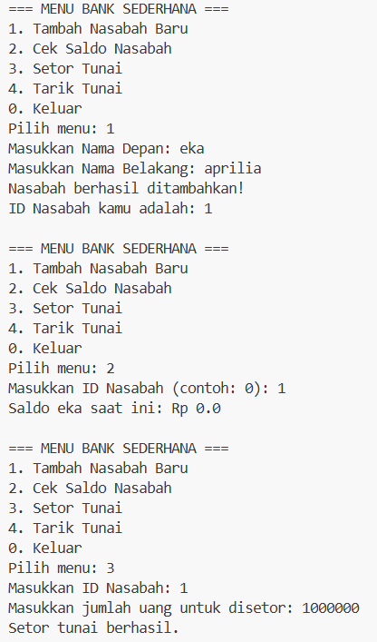
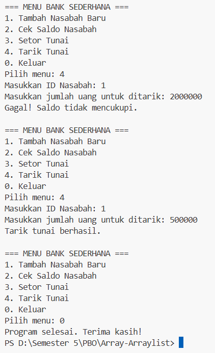

# Array-Arraylist
# Tugas PBO - Simulasi Bank Sederhana

Repo ini berisi tugas PBO untuk membuat simulasi sistem bank sederhana menggunakan bahasa Java. Kodenya dibuat dengan mengikuti kerangka diagram UML yang ada pada soal latihan.

### Penjelasan Class & Konsep OOP
Dalam program ini, ada relasi antar objek (*Composition*) yang dibagi jadi 3 bagian utama:

1. **Account**: Class ini khusus ngurusin uang dan saldo. Di sini ada logika/fungsi buat ngecek saldo, setor uang (`deposit`), dan tarik tunai (`withdraw`).
2. **Customer**: Class ini nyimpen data identitas nasabah (nama depan & belakang). Karena satu nasabah bisa buka beberapa rekening, data rekeningnya disimpan di dalam **Array** `Account[]` (dibatasi maksimal 5 rekening per nasabah).
3. **Bank**: Class ini fungsinya sebagai tempat yang menampung semua nasabah. Data nasabahnya disimpan menggunakan **Array** `Customer[]` (dibatasi maksimal 10 nasabah).
4. **Main**: Di file utama ini, terapat `java.util.Scanner` agar bisa dapat inputan dari user untuk ngetes fungsionalitas programnya (seperti mesin ATM mini) langsung lewat terminal.

### Screenshot Hasil Run Program
 
 
